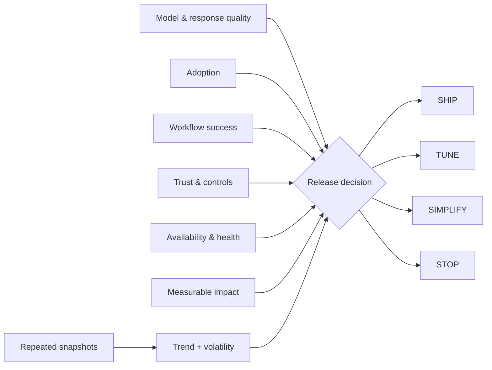

# MAUTAM — AI Product Evaluation

**EVALUATE flagship in the [Ash Intelligence Lab](https://github.com/AshIntelligence/agenticmine)**

**[▶ Try MAUTAM live](https://ash-intelligence-lab.streamlit.app/?product=mautam-evaluation)** · **[Open the full lab](https://ash-intelligence-lab.streamlit.app/)**

`Python · AI evaluation · observability · release gates`

Model quality is only one part of AI product health. MAUTAM evaluates six lenses together:

- **M**odel & Response Quality
- **A**doption
- **U**ser Workflow Success
- **T**rust & Controls
- **A**vailability & Health
- **M**easurable Business Impact

The evaluator combines a weighted score with hard trust and availability gates, then returns **SHIP / TUNE / SIMPLIFY / STOP**. A strong model score cannot cancel out a serious control or reliability failure.

## Decision logic

There are two views:

1. **Snapshot** — lens scores, weighted contribution, weakest lens, thresholds and gate failures.
2. **Window** — average health, per-lens volatility and an **IMPROVING / STABLE / DEGRADING** trend across repeated snapshots.

The window view catches a system that looks healthy at one point in time while the underlying trend is moving the wrong way.

## Architecture



## Run

```bash
python main.py
python main.py --test
python -m unittest discover -s tests -v
```

No external services or API keys are required.

## What it is designed to catch

- strong model output with weak workflow completion
- high usage with poor controls
- good offline scores with failing runtime health
- healthy point-in-time scores masking a deteriorating trend

## Next

Versioned evaluation windows, cohort trends, confidence intervals and capability-specific release gates.
