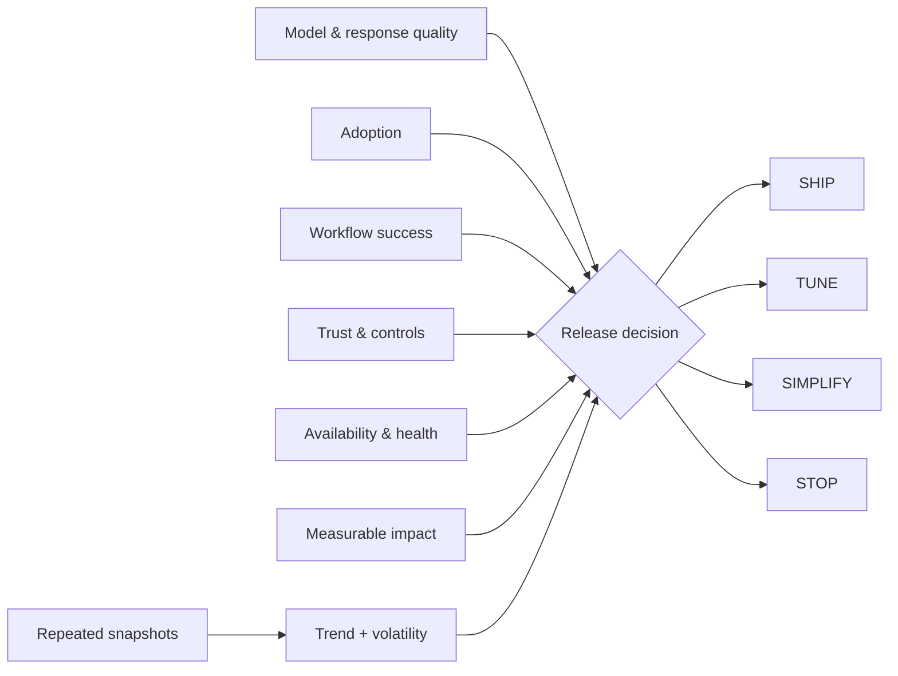

# MAUTAM — AI Product Evaluation

[](https://github.com/AshIntelligence/AI-Observability/actions/workflows/tests.yml)

**[▶ Try MAUTAM live](https://ash-intelligence-lab.streamlit.app/?product=mautam-evaluation)** · **[Explore the full systems lab](https://ash-intelligence-lab.streamlit.app/)**

`Python · AI evaluation · observability · release gates`

MAUTAM is a product-level evaluation system for six things I want to see together when deciding whether an AI capability is healthy enough to advance:

- **M**odel & Response Quality
- **A**doption
- **U**ser Workflow Success
- **T**rust & Controls
- **A**vailability & Health
- **M**easurable Business Impact

A good model score should not be able to hide a serious trust or reliability problem. MAUTAM therefore combines a weighted product score with hard trust and availability gates and maps the result to **SHIP / TUNE / SIMPLIFY / STOP**.

## What the code models

There are two evaluation levels:

1. **Snapshot evaluation** — weighted contributions, weakest-lens detection, configurable thresholds and explicit gate failures.
2. **Window evaluation** — average lens health, per-lens volatility and an **IMPROVING / STABLE / DEGRADING** trend across repeated snapshots.

The window view exists because one healthy run is not enough to describe product health.

## Architecture



## Run

```bash
python main.py
python main.py --test
python -m unittest discover -s tests -v
```

No external services or API keys are required.

## What it catches

Examples include strong model output with weak workflow completion, high usage with poor controls, good offline scores with failing runtime health, or a point-in-time score that looks fine while the underlying trend is deteriorating.

## Next

The next iteration is versioned evaluation windows, cohort trends, confidence intervals and capability-specific release gates.

This is one flagship from the broader [Ash Intelligence systems lab](https://github.com/AshIntelligence/agenticmine).