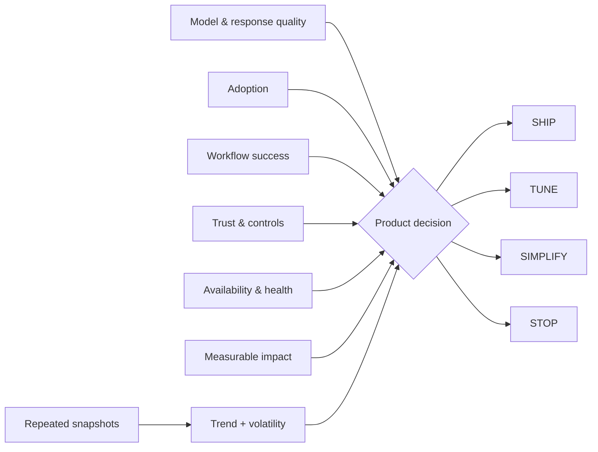

# MAUTAM — AI Product Evaluation

**EVALUATE · AI product health**

### Product question
**How do you decide whether an AI capability deserves to SHIP, TUNE, SIMPLIFY or STOP?**

**[▶ Try MAUTAM live](https://ash-intelligence-lab.streamlit.app/?product=mautam-evaluation)** · **[Explore the full systems lab](https://ash-intelligence-lab.streamlit.app/)**

`Python · AI evaluation · observability · release gates`

MAUTAM is the **EVALUATE** flagship in Ash Intelligence: a product-level measurement system that puts six things in the same decision surface instead of treating model quality as the whole product.

- **M**odel & Response Quality
- **A**doption
- **U**ser Workflow Success
- **T**rust & Controls
- **A**vailability & Health
- **M**easurable Business Impact

A strong model score should not be able to hide weak workflow completion, poor controls, runtime instability or a product nobody uses. MAUTAM combines a weighted product score with hard trust and availability gates, then maps the result to **SHIP / TUNE / SIMPLIFY / STOP**.

## What the code models

There are two evaluation levels:

1. **Snapshot evaluation** — weighted contributions, weakest-lens detection, configurable thresholds and explicit gate failures.
2. **Window evaluation** — average lens health, per-lens volatility and an **IMPROVING / STABLE / DEGRADING** trend across repeated snapshots.

The window view exists because one healthy run is not enough to describe product health.

## Architecture



## What it catches

Examples include:

- strong model output with weak workflow completion
- high usage with poor controls
- good offline scores with failing runtime health
- a healthy point-in-time score while the underlying trend is deteriorating
- technically impressive behavior with weak measurable product impact

The product principle is simple: **evaluation should change what gets funded, shipped, simplified or stopped.**

## Run

```bash
python main.py
python main.py --test
python -m unittest discover -s tests -v
```

No external services or API keys are required.

## Next

The next iteration is versioned evaluation windows, cohort trends, confidence intervals and capability-specific release gates.

Part of **EVALUATE** in the broader [Ash Intelligence Lab](https://github.com/AshIntelligence/agenticmine).
